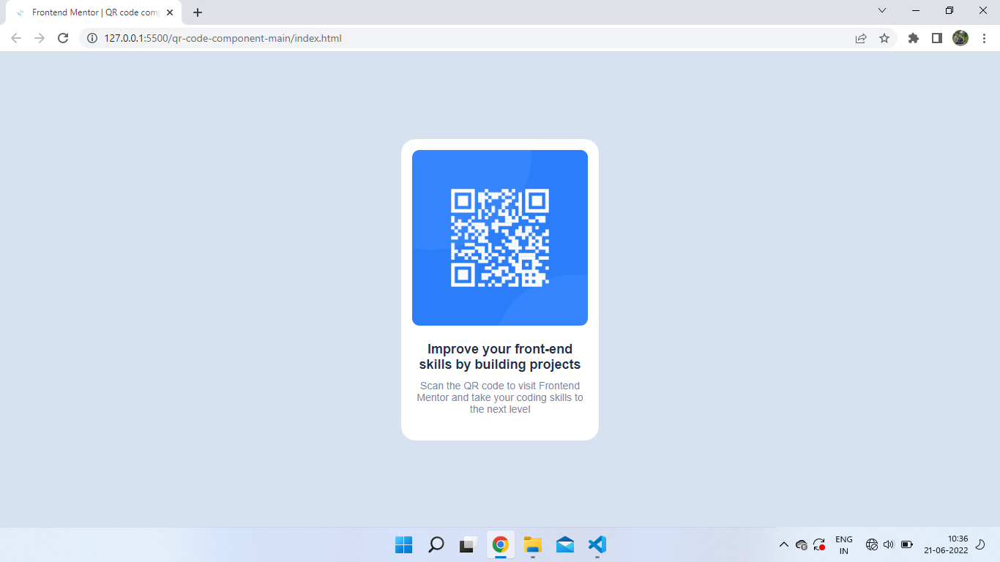

# Frontend Mentor - QR code component solution

This is a solution to the [QR code component challenge on Frontend Mentor](https://www.frontendmentor.io/challenges/qr-code-component-iux_sIO_H). Frontend Mentor challenges help you improve your coding skills by building realistic projects. 

## Table of contents

  - [Screenshot](#screenshot)
  - [Links](#links)
  - [Built with](#built-with)

### Screenshot

.png)

### Links

- Solution URL: [Add solution URL here](https://github.com/thapa14/QR-code-component-Frontend-mentor-challange)
- Live Site URL: [Add live site URL here](https://chipper-starburst-6df6e1.netlify.app/)

### Built with

- Semantic HTML5 markup
- CSS custom properties
- Flexbox
- CSS Grid
- Mobile-first workflow

